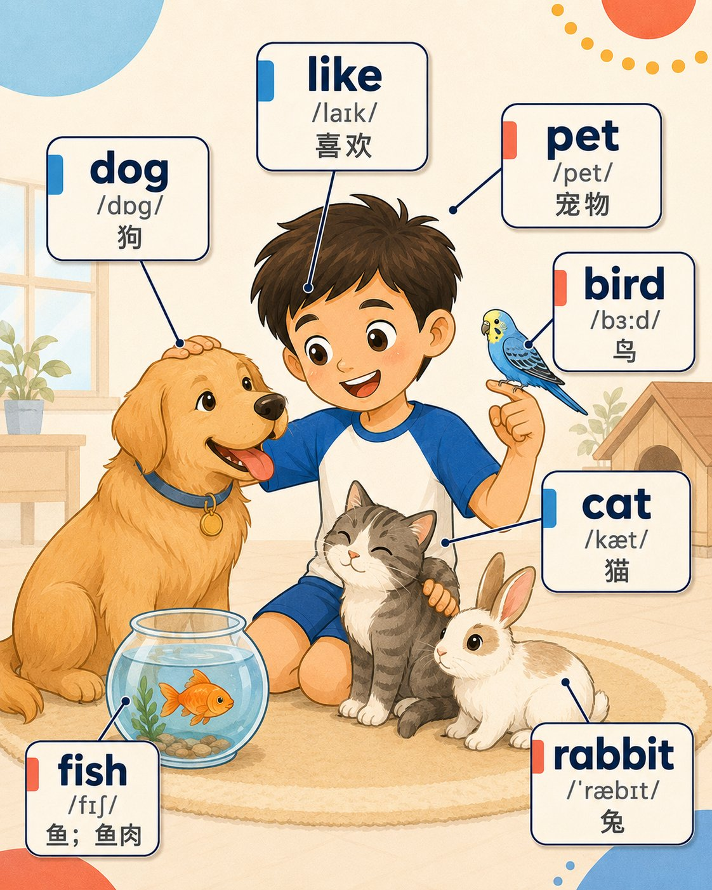
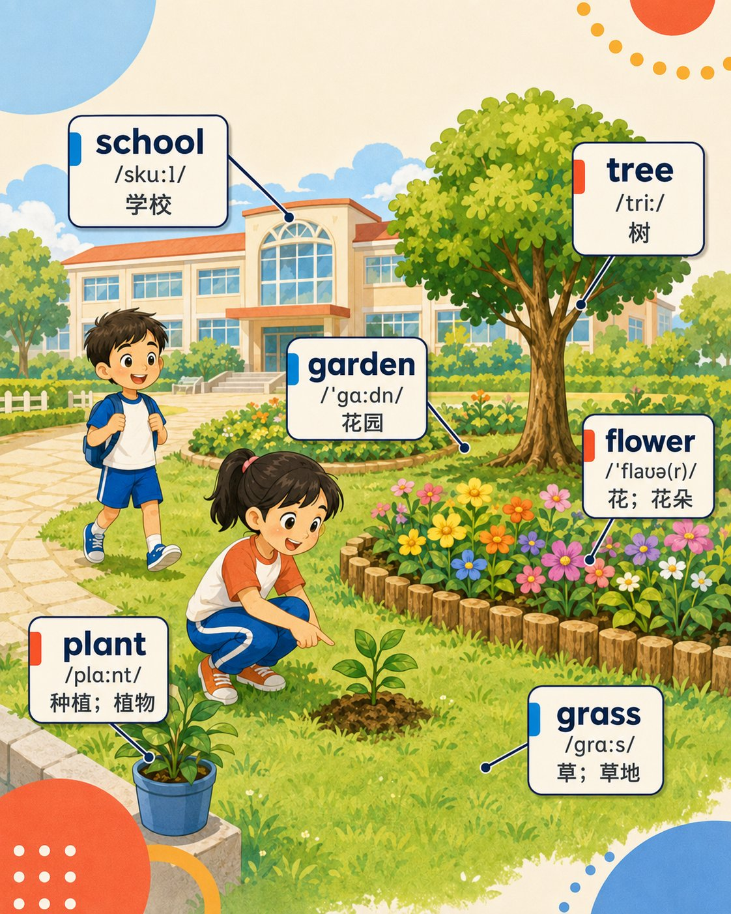
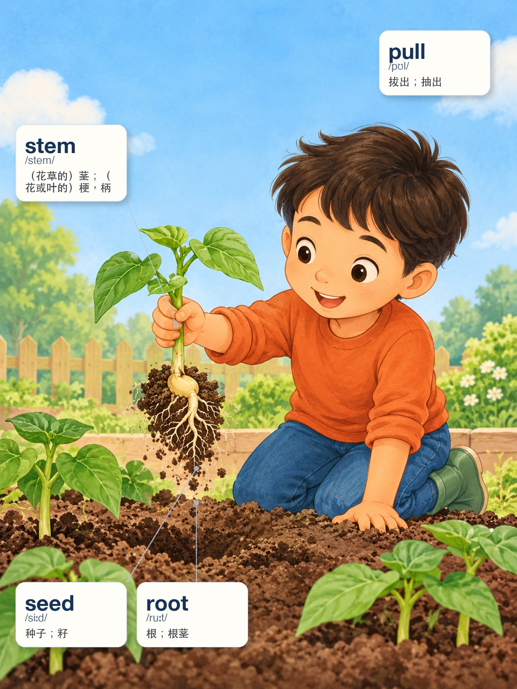
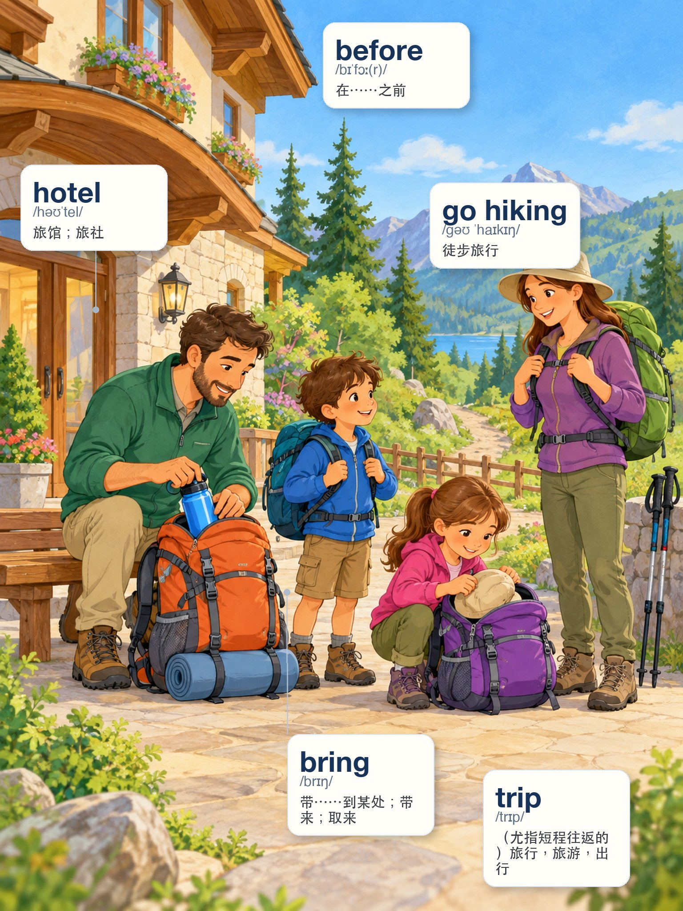

# Words Flashcard｜英语场景闪卡生成 Skill

> 把教材词表、自定义单词、短语或主题词汇，自动转换成场景化视觉闪卡。

**Words Flashcard** 是一套用于生成英语场景闪卡的 AI Skill。

你可以上传教材词表，也可以直接输入自己整理的一组单词。系统会分析词义、词类和场景关系，把适合放在一起的词组织成自然画面，再生成包含 **英文、IPA、中文释义、视觉标签和语义指引** 的学习卡片。

**它不限定年级，也不限定教材。**

你可以用它制作：

- 儿童英语启蒙词汇
- 小学 / 初中 / 高中教材词汇
- CET / IELTS / TOEFL 等考试词汇
- 日常生活主题词汇
- 旅游、商务、科技等专业词汇
- 自己整理的任意英语单词或短语

---

## 先看效果

### Grade 3｜三年级示例

<table>
<tr>
<td width="50%"></td>
<td width="50%"></td>
</tr>
<tr>
<td align="center"><b>Pets｜宠物</b></td>
<td align="center"><b>School Garden｜校园花园</b></td>
</tr>
</table>

### Grade 5｜五年级示例

<table>
<tr>
<td width="50%"></td>
<td width="50%"></td>
</tr>
<tr>
<td align="center"><b>Plant Parts｜植物结构</b></td>
<td align="center"><b>Hiking Trip｜徒步旅行</b></td>
</tr>
</table>

👉 **[查看完整 Demo Gallery](demo/README.md)**

当前公开 Demo 主要来自三年级和五年级英语词汇，因为这是目前已经完成并验证的一批案例。**Demo 的年级不代表 Skill 的使用范围。**

---

## 这个 Skill 是做什么的？

传统单词卡通常是：

```text
apple
/ˈæpl/
苹果
```

孩子或学习者看到的是一个孤立单词。

Words Flashcard 希望把词汇变成：

```text
单词
  ↓
画面中的对象 / 动作 / 人物 / 关系 / 状态
  ↓
场景理解
  ↓
英文 + IPA + 中文
```

例如你输入：

```text
dog
cat
bird
fish
rabbit
```

系统不会机械地把它们排成一张词表，而是会尝试组织成一个自然的 **Pets｜宠物** 场景，让学习者在同一幅画里理解这些词之间的关系。

---

## 你可以从任何词表开始

Words Flashcard 不要求必须使用某一本教材。

你可以直接输入：

```text
airport
passport
boarding pass
luggage
departure
```

也可以输入：

```text
algorithm
database
server
deployment
debug
```

也可以提供：

- 教材词汇表截图
- PDF / 图片中的词表
- Excel / CSV 词库
- Word 文档
- 自己整理的单词列表
- 某个主题的词汇
- 单词 + IPA + 中文释义
- 只有英文单词的原始列表

实际可直接读取的文件类型取决于当前 Agent 的文件处理能力；但只要词汇能够被结构化整理，就可以进入同一套场景闪卡生产流程。

---

## 谁可以使用？

### 学生 / 自学者

把自己正在背的单词变成视觉场景，适合日常词汇、考试词汇和主题学习。

### 教师 / 家长

把教材或自建词表做成课堂、复习、看图说词和打印学习素材。

### 教辅 / 教育内容创作者

用于批量制作英语词汇视觉内容、学习卡片和配套教辅素材。

### 英语培训 / 教育产品团队

把结构化词库转化为统一风格、可 QA、可批量生产的视觉学习资产。

### AI Agent 用户 / 开发者

可以在 Codex、ChatGPT、豆包工作、千问办公或其他 Agent 中使用这套 Skill，构建自己的批量闪卡工作流。

---

## 它和“直接让 AI 画一张单词卡”有什么区别？

直接让图片模型生成带文字的闪卡，常见问题包括：

- 单词、IPA 或中文写错
- 标签太小
- 连接线太长或指错对象
- 抽象词被强行指向某个物体
- 一张卡塞进太多不相关的词
- 每次生成画风漂移
- 换一个 AI 平台后结果完全不一致

Words Flashcard 的核心原则是：

> **AI 负责画场景，确定性系统负责教学事实。**

### AI 负责

- 人物
- 环境
- 动作
- 道具
- 氛围
- 插画

### 系统负责

- 英文单词
- IPA
- 中文释义
- 标签
- 连接线
- Card ID
- QA 检查

这样可以尽量避免图片模型直接生成教学文字带来的错误。

---

## 用户提供的数据是事实源

Words Flashcard 不默认把某一本教材当成唯一来源，而是遵循：

> **用户提供的数据是 Source of Truth。**

例如：

- 输入来自教材 → 以教材为准
- 输入来自 CSV / Excel → 以用户文件为准
- 用户已经指定 IPA / 中文释义 → 不擅自改写
- 某些字段缺失 → 可以补充，但应标记为生成内容或需要复核

这让同一套 Skill 既能用于教材，也能用于完全自定义的词库。

---

## 不同类型的单词，会用不同方式表达

不是所有单词都适合“拉一根线指向某个东西”。

### 具体物体 / 地点

例如：

```text
dog
tree
book
mountain
```

可以直接指向画面中的对象。

### 动作

例如：

```text
pull
bring
swim
clean
```

需要通过人物动作表达。

### 关系 / 所属 / 对比

例如：

```text
near
his
her
different
```

需要通过两个或多个对象之间的关系表达。

### 场景状态 / 抽象词

例如：

```text
interesting
famous
before
```

通常依赖整个场景理解，而不是强行给某个物体拉一根线。

因此 Words Flashcard 不是一个简单的 Prompt 集合，而是一套完整的 **Vocabulary → Scene → Flashcard** 生产流程。

---

## 从词表到闪卡

整个流程大致是：

```text
词表 / 自定义单词
   ↓
整理英文 / IPA / 中文等字段
   ↓
确认 Source of Truth
   ↓
按自然场景进行分组
   ↓
决定每个词的视觉表达方式
   ↓
生成无教学文字的场景插图
   ↓
加入英文 / IPA / 中文标签
   ↓
添加必要的语义连接线
   ↓
文本 + 语义 + 视觉 QA
   ↓
Approved Flashcard
```

系统会尽量避免：

> 为了把几个单词放在一起，而强行拼出一个不自然的场景。

---

## 场景闪卡的设计原则

一张合格的闪卡应该做到：

- 单词足够大，容易阅读
- IPA 和中文清楚
- 主要对象容易找到
- 图片本身能够帮助理解词义
- 连接线轻、细、短
- 不需要连接线的词不强行连线
- 标签不遮挡关键画面
- 同一张卡里的词属于一个自然场景
- 不为了“好看”牺牲教学准确性

---

## 支持多个 AI Agent

Words Flashcard 的核心规则与具体 AI 平台分离。

同一套生产标准，可以针对不同平台加载不同 Adapter。

| 平台 | 支持 | 主要作用 |
| --- | --- | --- |
| OpenAI / Codex | ✅ | 工具调用、文件、Composer 与 QA 流程 |
| 豆包工作 | ✅ | 修正标签偏小、长连线、视觉漂移等问题 |
| 千问办公 | ✅ | 修正卡型路由、抽象词映射、锚点与布局问题 |
| 其他 Agent | 可接入 | 通过 Generic Adapter 实现 |

运行时规则顺序：

```text
Agent Contract → Core → 当前平台 Adapter → 当前任务
```

不同平台可以有自己的适配规则，但不会改变核心产品标准。

---

## 快速开始

### 方法一：直接交给你的 Agent

把这个仓库提供给 Agent，然后告诉它：

```text
请按照这个仓库中的 SKILL.md 执行。
```

推荐读取顺序：

1. [`SKILL.md`](SKILL.md)
2. [`AGENT_CONTRACT.md`](AGENT_CONTRACT.md)
3. [`ADAPTER_ROUTING.md`](ADAPTER_ROUTING.md)
4. 当前平台对应的 Adapter

### 方法二：Clone 仓库

```bash
git clone https://github.com/chaogevision/words-flashcard.git
cd words-flashcard
```

验证 Skill 是否完整：

```bash
python tools/validate_package.py . --strict
```

正常应看到：

```text
PACKAGE VALIDATION: PASS
```

然后让 Agent 从 [`SKILL.md`](SKILL.md) 开始执行。

---

## Demo 和 Golden Set 的区别

### `demo/`

给人看的成品展示区，用于查看：

- 不同主题
- 不同词类
- 不同场景组织方式
- 最终闪卡的整体效果

👉 **[查看 Demo Gallery](demo/README.md)**

### `assets/golden_set/`

给 Agent 和生产系统使用的正式视觉基准，用于控制：

- 插画风格
- 标签样式
- 连接线
- 信息层级
- 整体视觉一致性

Demo 好看不等于自动成为 Golden Sample；进入 Golden Set 仍需符合当前版本 QA 规则。

---

## 项目结构

如果你只是使用这个 Skill，其实不需要理解所有目录。

如果你想开发、修改或为新的 Agent 增加 Adapter，可以继续阅读：

```text
words-flashcard/
├── SKILL.md                 # Skill 主入口
├── AGENT_CONTRACT.md        # 跨 Agent 执行合同
├── core/                    # 分组、视觉、Source of Truth、QA 核心规则
├── engine/                  # Prompt / Composer / QA / 状态机接口
├── schemas/                 # 标准数据结构
├── adapters/                # 不同 Agent 的专属适配规则
├── assets/golden_set/       # 正式视觉基准
├── demo/                    # 面向用户的成品案例
└── tools/                   # 校验与辅助工具
```

---

## 当前版本

- Skill Protocol: **2.2.2**
- Agent Contract: **1.0**
- Visual Spec: **Flashcard Visual Spec V2**
- Connector: **`connector.v3.light`**

当前已经包含：

- Agent-Agnostic 核心协议
- Stage 01–11 完整生产流程
- OpenAI / Codex Adapter
- 豆包工作 Adapter
- 千问办公 Adapter
- Demo Gallery
- Golden Set
- JSON Schema
- QA 规则
- Package Validator

---

## 查看更多

- 🎨 [Demo Gallery](demo/README.md)
- 🚀 [SKILL.md](SKILL.md)
- 🤖 [Agent Contract](AGENT_CONTRACT.md)
- 🔀 [Adapter Routing](ADAPTER_ROUTING.md)
- 🎯 [Visual Spec](core/visual_spec.md)
- 🔗 [Connector Spec](core/connector_system_v3.md)
- ✅ [QA Rules](core/qa_rules.md)

---

## 项目目标

Words Flashcard 不是为了让 AI：

> “画一张看起来很漂亮的单词卡。”

而是希望建立一套可以长期复用的：

> **Vocabulary → Scene → Visual Learning Content**

生产方法。

无论词汇来自教材、考试词库、个人单词表还是专业主题，只要能够被结构化描述，就可以进入同一套 Scene Grouping、Visual Mapping、Composition 和 QA 流程。

目标是让不同年级、不同主题、不同 AI Agent 生成出来的内容，都尽可能保持：

**词义准确、视觉统一、场景自然、可批量生产。**

---

## Roadmap

- [x] Agent-Agnostic Stage 01–11 协议
- [x] OpenAI / Codex Adapter
- [x] 豆包工作 Adapter
- [x] 千问办公 Adapter
- [x] 三年级场景闪卡 Demo
- [x] 五年级场景闪卡 Demo
- [ ] 更多教材与年级案例
- [ ] 考试 / 主题 / 专业词汇 Demo
- [ ] 更完整的自动化 Composer
- [ ] 自动视觉 QA 与批量返修
- [ ] 更多 Agent / 图片工作流 Adapter

---

如果你是第一次来到这个项目：

👉 **先看 [Demo Gallery](demo/README.md)**

如果你已经准备开始制作自己的英语场景闪卡：

👉 **从 [SKILL.md](SKILL.md) 开始。**
