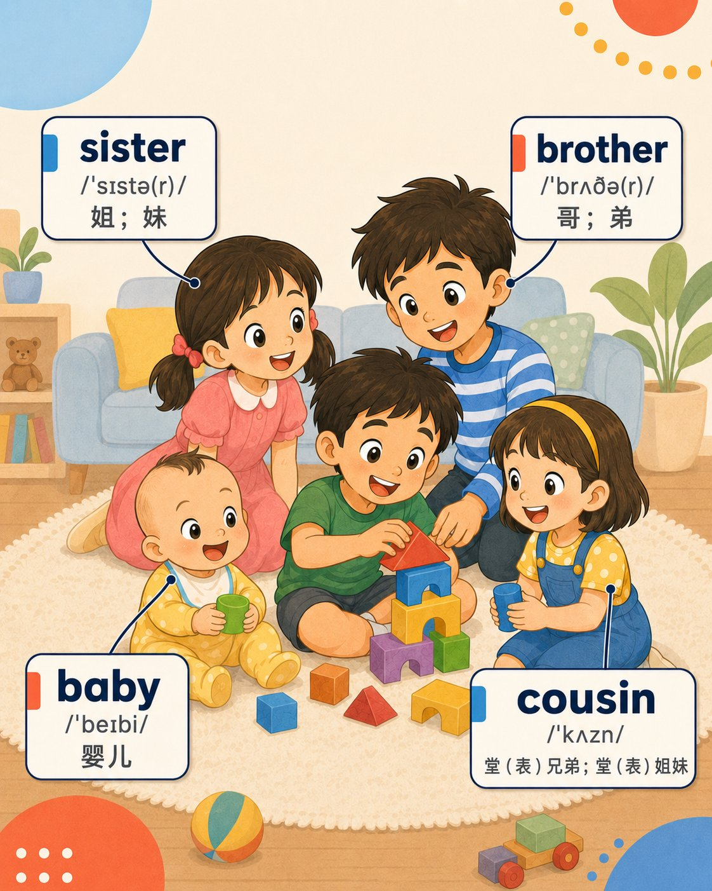
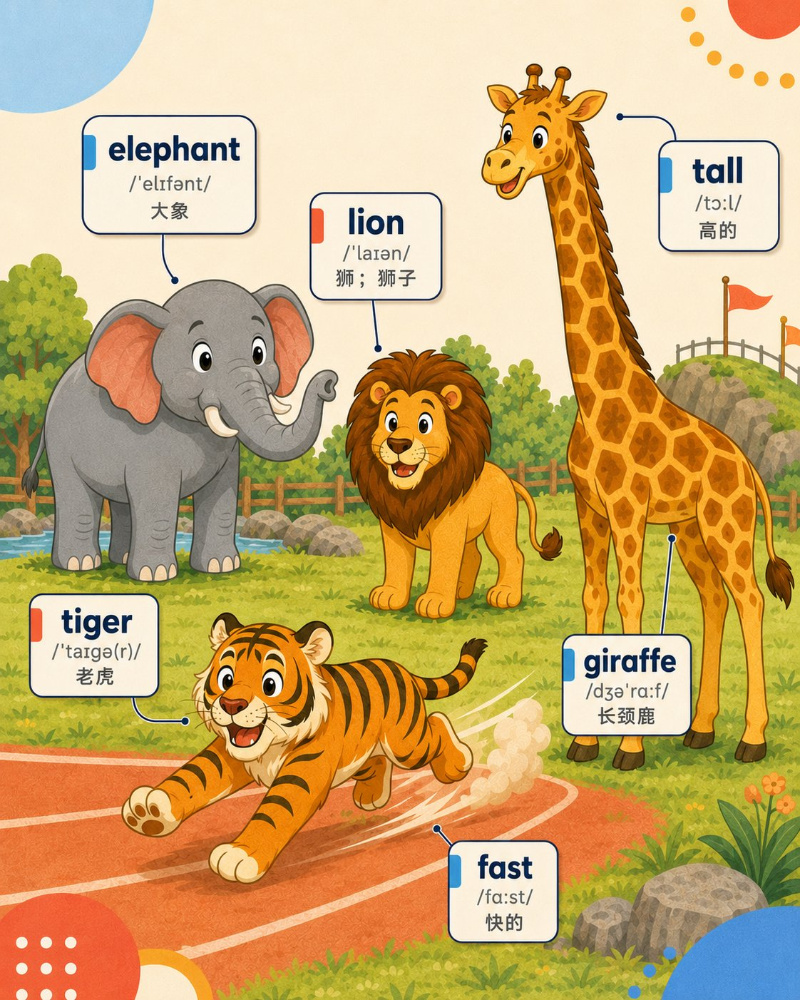
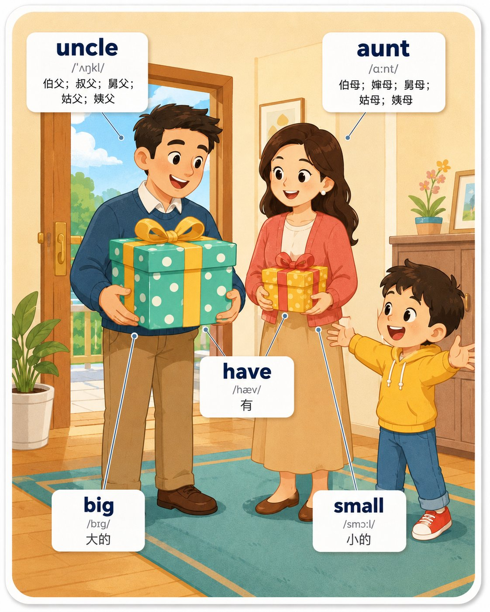
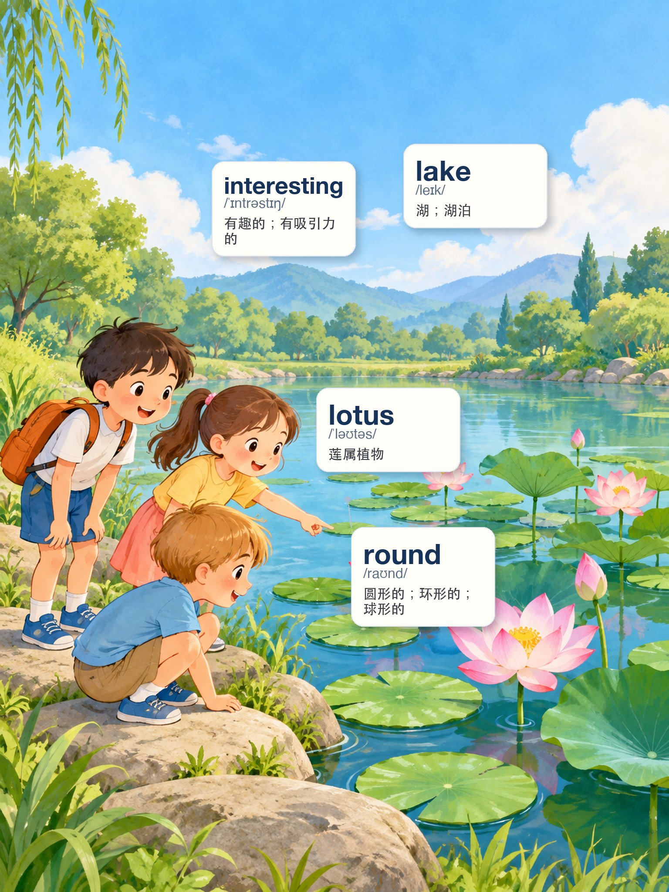
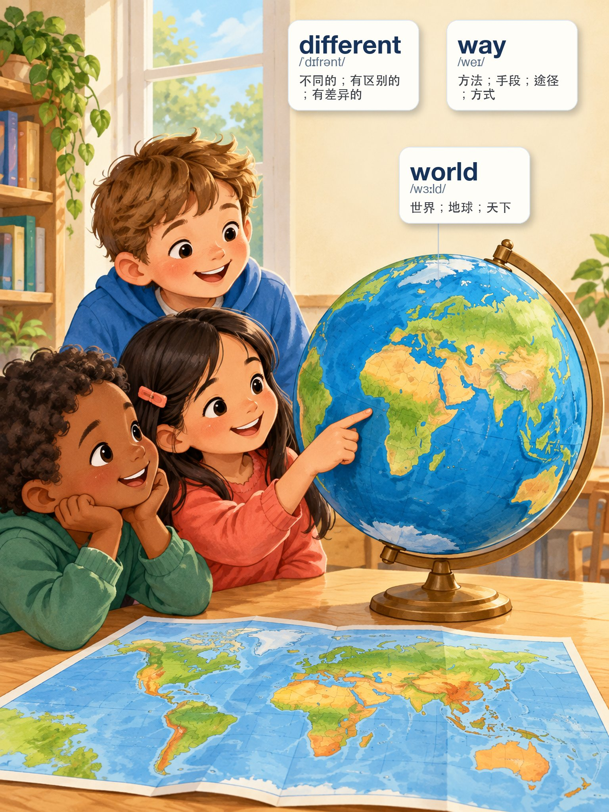
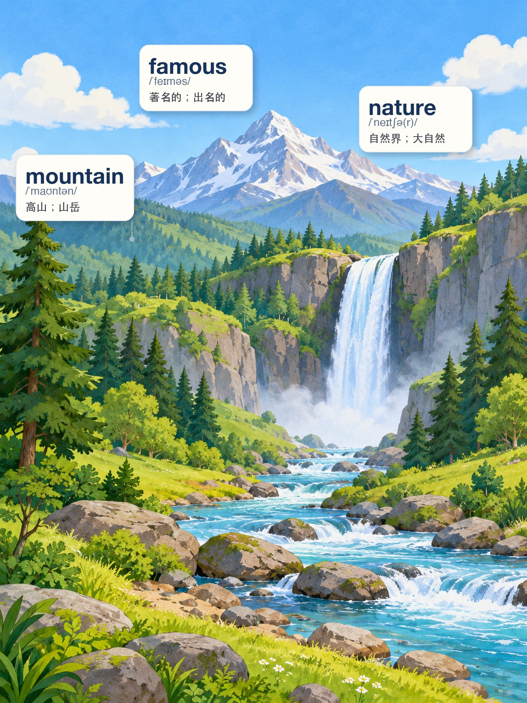

# Demo Gallery｜高清成品示例

这里展示 Words Flashcard 已完成的场景闪卡成品。目标很简单：**先看效果，再决定要不要深入了解 Skill 的内部规则。**

> `demo/` 是面向用户的展示层；`assets/golden_set/` 是面向生产系统的严格基准层。Demo 中的卡片可以展示不同年级、不同卡型和场景设计，但是否进入 Golden Set 仍以当前版本 QA 为准。

## 三年级上册｜Grade 3

### 01 · Pets｜宠物

`dog · like · pet · bird · cat · fish · rabbit`

### 02 · School Garden｜校园花园

`school · tree · garden · flower · plant · grass`

### 03 · Family｜家庭成员

`sister · brother · baby · cousin`

### 04 · Animals｜动物与特征

`elephant · lion · tiger · giraffe · tall · fast`

### 05 · Family Gifts｜家庭人物与大小对比

`uncle · aunt · have · big · small`

---

## 五年级上册｜Grade 5

### 20 · Plant Parts｜植物结构与动作

`stem · pull · seed · root`

### 21 · Lake & Lotus｜湖泊与莲属植物

`interesting · lake · lotus · round`

### 22 · World｜世界与差异

`different · way · world`

### 23 · Nature｜自然景观

`famous · nature · mountain`

### 24 · Hiking Trip｜徒步旅行

`before · hotel · go hiking · bring · trip`

---

## 这些 Demo 展示了什么？

这 10 张卡覆盖了不同的视觉表达机制：

- **Object / Place**：动物、学校、花园、湖泊、山脉等直接可指认目标；
- **Action**：`pull`、`bring`、`go hiking` 等动作或任务；
- **Relation / Comparison**：`big / small`、`different` 等需要关系或对比才能表达的词；
- **Scene State / Context**：`interesting`、`famous`、`before` 等不能简单“拉一根线指物”的词。

这也是 Skill 为什么需要先做 **Scene Grouping + Mapping Mode**，而不是把同一 Unit 的单词全部硬塞进一张图。

## 关于图片

本目录用于 GitHub 展示时，应保留足以查看文字、音标、中文和连接线细节的高清版本，而不是 320px 缩略图。正式印刷/生产母版仍建议由各批次 Artifact Store 保存原始 PNG。

## 想自己生成？

回到项目首页查看 [Quick Start](../README.md#快速开始)，或者直接从 [`SKILL.md`](../SKILL.md) 开始。